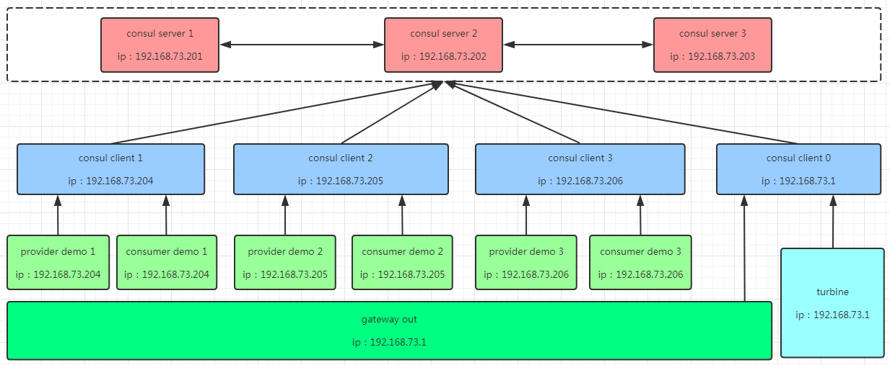
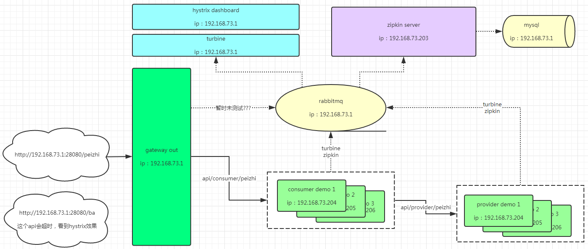

# jkitchen_note_sc

spring cloud demo，[官方文档地址](https://cloud.spring.io/spring-cloud-static/Finchley.RELEASE/single/spring-cloud.html)，[参考博客](https://windmt.com/tags/Finchley/)，[参考博客作者的github](https://github.com/zhaoyibo/spring-cloud-study/)

    

#### 测试机器，共7台：

192.168.73.201，部署consul server
192.168.73.202，部署consul server
192.168.73.203，部署consul server，部署zipkin-server
192.168.73.204，部署consul client，部署provider demo，部署consumer demo
192.168.73.205，部署consul client，部署provider demo，部署consumer demo
192.168.73.206，部署consul client，部署provider demo，部署consumer demo
192.168.73.1，部署consul client，部署gateway，部署turbine，部署hystrixdashboard，部署mysql，部署rabbitmq

#### consul服务注册图：

#### 业务API数据流程图：

#### 组件：

- [文档](sc-demo-provider/md/consulDiscovery.md) consul 注册中心
- [文档](sc-demo-provider/md/consulKeyValue.md) consul 配置中心
- [文档](sc-demo-gateway/README.md) gateway 网关
- [文档](sc-demo-hystrixdashboard/README.md) hystrix dashboard 熔断器仪表盘
- [文档](sc-demo-turbine/README.md) turbine 集群信息收集
- [文档](sc-demo-consumer/md/sleuth.md) Sleuth+Zipkin 分布式链路跟踪
- [文档-无](#) feign+ribbon 通信+客户端负载均衡

#### demo服务端口号占用：

| 服务名 | 端口号 |
|--------|--------|
| sc-demo-provider | 8080 |
| sc-demo-consumer | 18080 |
| sc-demo-gateway | 28080 |
| sc-demo-turbine | 48080 |
| sc-demo-hystrixdashboard | 58080 |

#### web地址访问：

| web服务 | 访问地址 | 类型 |
|--------|--------|--------|
| consul | http://192.168.73.201:8500 | web ui |
| rabbitmq | http://192.168.73.1:15672 | web ui |
| hystrixdashboard | http://192.168.73.1:58080/hystrix | web ui |
| zipkin | http://192.168.73.203:9411 | web ui |
| turbine | http://192.168.73.1:48080/turbine.stream | api |
| gateway | http://192.168.73.1:28080/ | api |
