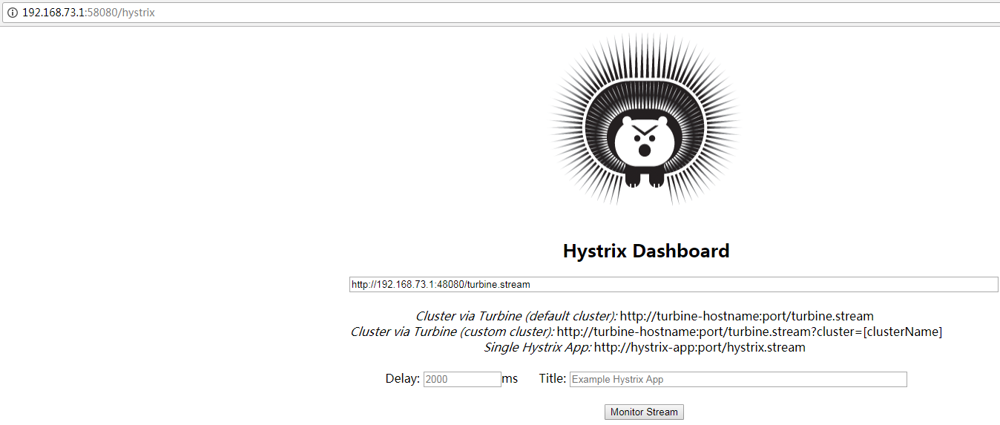

# dashboard

访问地址：http://localhost:58080/hystrix/



#### 一、被监控的业务服务

参考项目 `sc-demo-consumer`


配置文件中增加
```
# for Hystrix Metrics Stream 监控页面
# http://localhost:18080/actuator/hystrix.stream
# pom中引入actuator组件，默认提供监控页面是/actuator/info和/actuator/health
management.endpoints.web.exposure.include: info, health, hystrix.stream
```

#### 二、集群监控

需要启动 `sc-demo-turbine`

在页面输入地址（turbine的一个接口）

http://localhost:48080/turbine.stream

然后访问 consumer 的业务接口，就能在监控中看到效果

#### 三、单机器监控

在页面输入地址（consumer的一个接口）

http://localhost:18080/actuator/hystrix.stream

然后访问 consumer 的业务接口，就能在监控中看到效果

#### 四、 仪表盘说明

