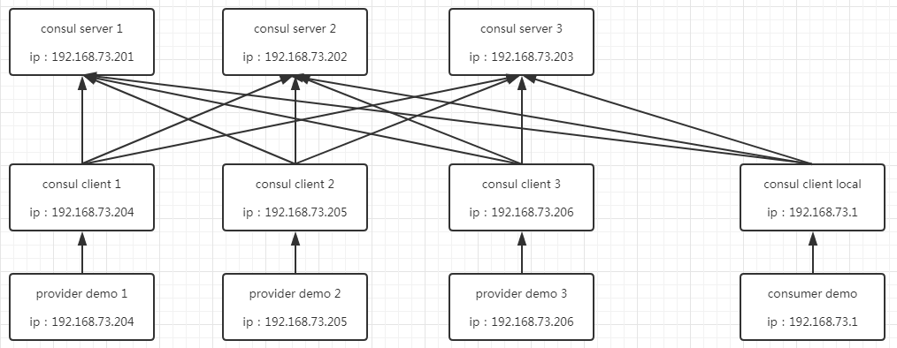

# consul 服务发现

[consul集群介绍](consul集群介绍.md)

#### 业务服务端

参考项目 `sc-demo-provider`

启动类增加注解
```
@EnableDiscoveryClient
```

#### 测试使用机器共7台：

- 192.168.73.1，部署consul client，部署consumer demo
- 192.168.73.201，部署consul server
- 192.168.73.202，部署consul server
- 192.168.73.203，部署consul server
- 192.168.73.204，部署consul client，部署provider demo
- 192.168.73.205，部署consul client，部署provider demo
- 192.168.73.206，部署consul client，部署provider demo

#### 测试部署图



#### web页面访问

http://192.168.73.201:8500/ui/consul-cluster/nodes


