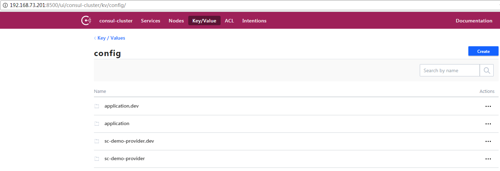

# consul 配置中心说明

官方文档地址：

https://cloud.spring.io/spring-cloud-static/Finchley.RELEASE/single/spring-cloud.html#spring-cloud-consul-config

## 一、 consul Key / Value

http://192.168.73.201:8500/ui/consul-cluster/kv

可以创建文件夹，文件，K-V

配合springboot提供的profile
- dev：默认开发环境
- test:测试环境
- prod：生产环境

默认创建方法规范：
- 全局：顶层目录名是config，二级目录名是application（,环境），三级是文件名或者key名。如：
	- config/application/data
	- config/application,dev/data
- 指定服务：顶层目录名是config，二级目录名是服务名（,环境），三级是文件名或者key名。如：
	- config/sc-demo-provider/data
	- config/sc-demo-provider,dev/data

注意：
- 优先读取指定服务指定环境中的数据
- 优先读取指定服务中的属性，再读取全局中的属性
- 使用文件的形式，默认文件名是data



## 二、 业务服务端 bootstrap.yml

使用consul配置中心需要在bootstrap.yml中定义，bootstrap.yml是第一启动文件，道理就是先拿到配置才能启动服务。

spring.cloud.config.format，四种类型，consul配置中心可以存储文件或者K-V。

- YAML
- PROPERTIES
- KEY-VALUE
- FILES

### 2.1 YAML或PROPERTIES

使用consul配置中心存储YAML或者PROPERTIES类型文件

需要增加配置spring.cloud.config.data-key，可以理解为文件名

consul配置中心value的写法：

- YAML，注意空格
```
name: aaa
number: 111
```

- PROPERTIES
```
name=aaa
number=111
```

### 2.2 KEY-VALUE

使用consul配置中心存储K-V

### 2.3 FILES

似乎是和git配合使用，我没有使用这种方式

## 三、业务服务端代码

参考项目 `sc-demo-provider`

### 3.1 ConfigurationProperties

`com.sauzny.scdemoprovider.MyConfigurationDemo01`使用注解`@ConfigurationProperties`

并在`com.sauzny.scdemoprovider.ProviderApp`增加注解`@EnableConfigurationProperties({MyConfigurationDemo01.class})`

实现获取属性数据并能实时刷新

### 3.2 static属性值

`com.sauzny.scdemoprovider.MyConfigurationDemo02`，这种发方式不能实时刷新

### 3.3 @Value("${key}")

`com.sauzny.scdemoprovider.MyConfigurationDemo03`，可以实时刷新


