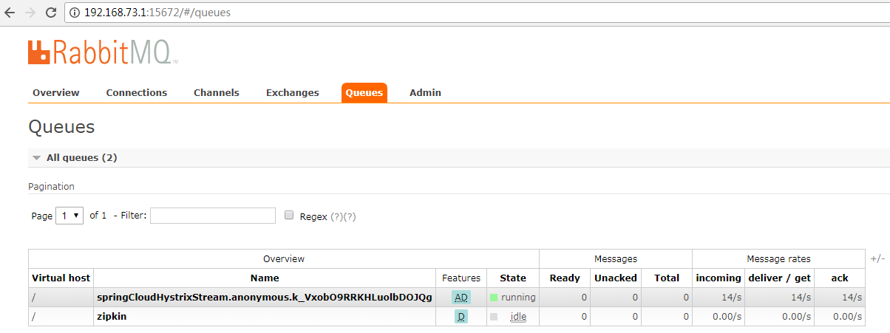

# turbine

完整部署图（盗用了eureka，我这里使用的是consul）


#### turbine服务端

参考项目 `sc-demo-turbine`

启动服务，API地址：http://localhost:48080/turbine.stream

#### 业务服务端

参考项目 `sc-demo-consumer`

pom中引入组件

```
spring-cloud-starter-netflix-hystrix
spring-cloud-netflix-hystrix-stream
spring-cloud-stream-binder-rabbit
```

启动类增加注解

```
@EnableCircuitBreaker
```

#### rabbitmq

rabbitmq的webui中可以查看队列：http://192.168.73.1:15672/#/queues

